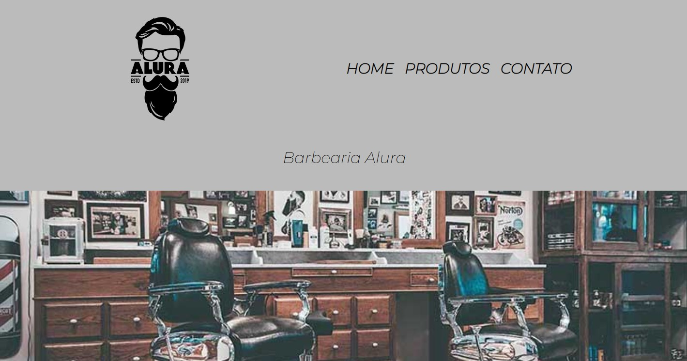

<h1>Barbearia Alura </h1>

Projeto do curso de HTML5 e CSS3: criando uma página web, em que fiz da plataforma Alura.

* Entendi a estrutura básica de um arquivo HTML
* Utilizei o navegador para inspecionar elementos
* Aprendi a definir estilos para elementos usando o CSS

## Tecnologias

Esse projeto foi desenvolvido com as seguintes tecnologias:

- HTML e CSS
- JavaScript
- Git e Github

## Link da página do projeto  

<a href="https://rsantosmartins.github.io/barbearia-alura/">Visite a página</a>

